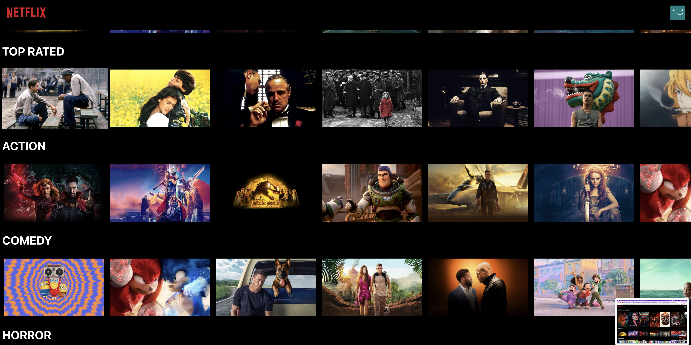
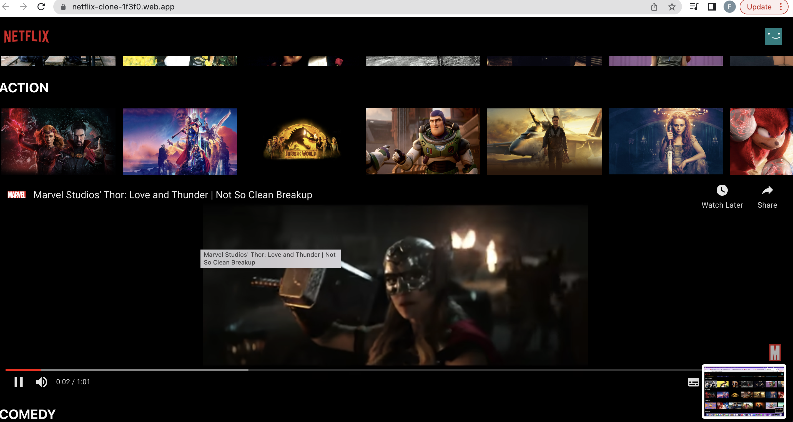
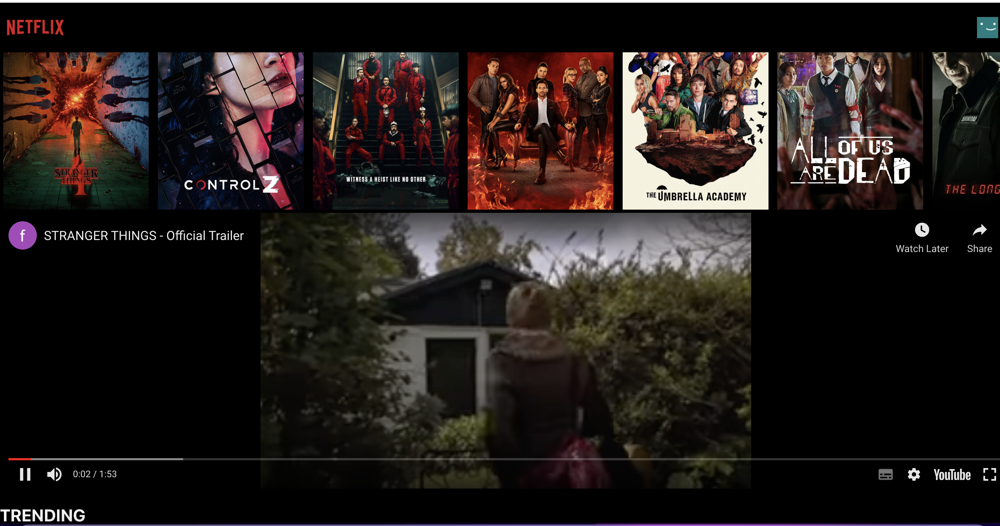

# Netflix Clone
This is a simple clone of the Netflix user interface created with React. It does not have a backend and the data for movies is being fetched from an API provided by IMDB. 

## Deployment
The application is hosted on firebase and can be visited using the given link:
<a href="https://netflix-clone-1f3f0.web.app/" target="_blank">   https://netflix-clone-1f3f0.web.app/</a>

## Project Setup

In the project directory, you have to run the given command to install the dependencies:

### `npm install`

In the project directory, you can run the given command to launch the application:

### `npm start`

## Screenshots

